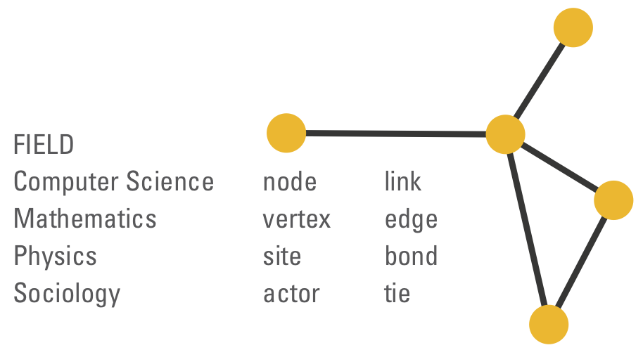

```{r setup, include=FALSE}
knitr::opts_chunk$set(echo = TRUE, comment = "", fig.align = "center",
                      fig.width = 8, fig.height = 8)
```

```{css, echo=FALSE}
blockquote {
    padding: 10px 20px;
    margin: 0 0 20px;
    font-size: 14px;
    color: #828282;
    border-left: 10px solid #EEE;
}
body {
    font-size: 14px;
}
```


Este texto es una introducción aplicada al análisis descriptivo de redes sociales en R. La investigación de redes sociales se enfoca en las conexiones que atan unos actores con otros, en lugar de los atributos medidos a nivel individual (ej. ingreso, edad, género). El tema es enorme y el [aparato matemático](https://es.wikipedia.org/wiki/Teor%C3%ADa_de_grafos) que los sotiene se extiende mucho más allá de las ciencias sociales.

Como ejemplo, vamos a usar mi "red personal" en Twitter: las conexiones que describen quién sigue a quién entre las personas que yo [@acastroaraujo](https://twitter.com/acastroaraujo) sigo. Les voy a mostrar cómo describir las propiedades de la red y de los "nodos" (i.e. los punticos) usando el paquete [__`igraph`__](https://igraph.org/r/).

El único requisito es estar familiarizado con R (ver [aquí](https://es.r4ds.hadley.nz/) para una buena introducción).

Nota: La terminología no está muy bien estandarizada, entonces les dejo la siguiente imagen (en inglés).

```{r, out.width="400px", echo=FALSE}

```

## Los datos

1. Descargar la información y la lista de "amigos" de la persona focal.

```{r}
library(tidyverse)
library(rtweet)
source("createTokens.R")
source("getEdgeList.R")  ## aquí hay función que agarra amigos con múltiples tokens

ego <- "acastroaraujo"
ego_info <- lookup_users(ego)
friends <- get_friends("acastroaraujo", n = ego_info$friends_count)
friends
```

2. Por cada "amigo", descargar una lista de amigos y guardarla. Este paso puede ser muy demorado. Lo mejor es irse a dormir mientras descargan los datos y retomar el día siguiente.

```{r}
outfolder <- "friends/"
if (!dir.exists(outfolder)) dir.create(outfolder)  ## crear una carpeta, si no existe
friends_done <- str_replace(list.files(outfolder), ".rds", "")
friends_left <- setdiff(friends$user_id, friends_done)

while (length(friends_left) > 0) { 
  
  new_user <- friends_left[[1]]
  
  friends_of_friend <- try(get_edge_list_of_friends(new_user))
  
  file_name <- paste0(outfolder, new_user, ".rds")
  write_rds(friends_of_friend, file_name, compress = "gz")
  friends_left <- friends_left[-which(friends_left %in% new_user)] ## int. subset
}

```

3. Armar una "lista de incidencia" con base en los archivos descargados.

```{r}
edge_list <- list.files(outfolder, full.names = TRUE) %>% 
  map(read_rds)
  
index <- edge_list %>%  ## vector que sirve para 
  map(class) %>%        ## descartar errores de descarga,
  map_chr(pluck, 1)     ## cuentas protegidas, etc.

edge_list <- edge_list[index == "tbl_df"] %>% 
  bind_rows()

edge_list
```

4. Descargar la información disponible para cada amigo (ojo que ya no son 718 sino 707).

```{r}
friends_info <- lookup_users(unique(edge_list$from), token = token) %>% 
  select(user_id, screen_name, ends_with("count"), lang, name, location, description,
         -starts_with("quote"), -starts_with("retweet"), -reply_count,
         -starts_with("fav"))

friends_info
```

5. Crear la red usando `igraph`. Ojo que al paso intermedio, que descarta todos los usuarios a los que yo no estoy siguiendo (incluyéndome a mí).

```{r, message=FALSE}
library(igraph)
ego_network <- edge_list %>% 
  filter(to %in% from) %>% ## ojo aquí!!
  graph_from_data_frame(directed = TRUE, vertices = friends_info)

## esta función sólo la usamos para mostrar información útil, no es más.
tidygraph::as_tbl_graph(ego_network) 
```

Al final, logramos descargar las conexiones que existen entre 707 personas que yo sigo en Twitter. En total hay 30,803 conexiones y 4 componentes (más sobre esto en la siguiente sección).

Podemos usar el paquete `ggraph` para visualizar esta red, incluso si no es una imágen muy útil:

```{r, eval=FALSE}
library(ggraph)

ego_network %>% 
  ggraph("kk") + 
  geom_node_point() +
  geom_edge_link(alpha = 0.2) +
  theme_graph()
```


## Propiedades de la red

```{r, message=FALSE, echo=FALSE}
ego_network <- read_rds("ego_network.rds")
```

En la gráfica anterior pudimos ver que hay algunos amigos aíslados. Si un gráfico no está enteramente conectado, es usual dividirlo en "componentes". Podemos usar `igraph` para ver el número de componentes y el tamaño de cada uno.

```{r}
igraph::components(ego_network)$no      ## número de componentes
igraph::components(ego_network)$csize   ## tamaño de cada uno
```

Entonces hay tres nodos completamente aislados. Es decir, ninguno de mis otros amigos sigue a estos tres amigos, y ninguno de estos tres sigue a alguno de mis otros amigos.

```{r}
igraph::decompose(ego_network)[2:4] %>% map(igraph::V) ## outliers
```

En adelante, los vamos a borrar de la red.

```{r}
ego_network <- igraph::decompose(ego_network)[[1]] ## "giant component"
```

Clusterrrrr

```{r}
clusters <- igraph::cluster_walktrap(graph = ego_network, steps = 5)

df <- tibble(group = clusters$membership, name = clusters$names)
  
df %>% count(group) %>% arrange(desc(n))
```

```{r}
friends_info2 <- friends_info %>% 
  inner_join(df)
```

```{r}
friends_info2 %>% 
  arrange(desc(followers_count)) %>% 
  group_split(group)
```


Lenguaje

```{r}
friends_info2 %>% 
  group_by(group) %>% 
  count(lang)
```


Kidding!

```{r}
V(ego_network)$clique <- clusters$membership
```

```{r}
friends_info <- friends_info %>% 
  inner_join(df)
```

```{r}
friends_info %>% 
  arrange(desc(followers_count)) %>% 
  group_split(group)
```


## Properties of nodes

```{r}
igraph::V(ego_network)$out_degree <- igraph::degree(ego_network, mode = "out")
igraph::V(ego_network)$in_degree <- igraph::degree(ego_network, mode = "in")
igraph::V(ego_network)$closeness <- igraph::closeness(ego_network, mode = "out")
igraph::V(ego_network)$betweenness <- igraph::betweenness(ego_network, directed = TRUE)

igraph::V(ego_network)$authority_score <- igraph::authority_score(ego_network)$vector
igraph::V(ego_network)$eigen_centrality <- igraph::eigen_centrality(ego_network)$vector
```


Entonces al interior de cada grupo quién es el más

```{r}
#igraph::induced_subgraph(ego_network, v = df
```

More references:

General: Kleinberg & Easley, pero para la parte económica mejor saltar a Jackson

Networks Newman

Redes personales: Conducting Personal Network Research: A Practical Guide

Social Structes Levi Martin

How Behavior Spreads Centola

Complex Spreading Phenomena in Social Systems Lehman


S.Milgram, “The small world problem,” Psychology today, 1967. + Duncan Watts

D. Cartwright and F. Harary, “Structural balance: a generalization of Heider’s theory.,” Psychological Review, vol. 63, no. 5, pp. 277–293, 1956.

M. Granovetter, “Threshold Models of Collective Behavior,” The American Journal of Sociology, vol. 83, no. 6, pp. 1420–1443, May 1978.

M. Granovetter, “The strength of weak ties: A network theory revisited,” Sociological theory, vol. 1, pp. 201–233, 1983.

M. McPherson, L. Smith-Lovin, and J. M. Cook, “Birds of a Feather: Homophily in Social Networks,” Annual review of sociology, vol. 27, pp. 415–444, Jan. 2001.

Shalizi & Thomas on Collider Bias

Barberá, everything

Breiger on affiliation networks

More:

Undirected graphs

Ideology


```{r}
library(Rtsne)

# Get adj from graph, then do corr and t-sne
```


